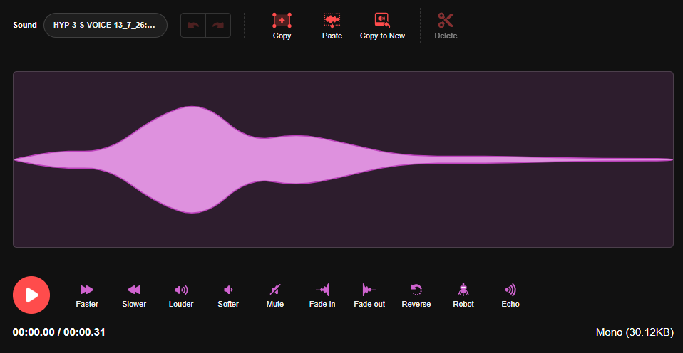
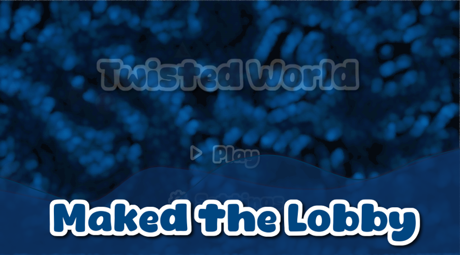

@ Tasks

- Add TOS an PP
- Make the settings menu
- Make at least 5 Levels
- Add Mobile support
.

.

.

.

.
# Devlog 1 : Building the Game Lobby

## Designing the UI

I started by designing the main lobby buttons: Play and Settings They don't actually do anything yet since I haven't programmed their functionality, but I wanted to establish the overall look of the menu first
I also created the game's logo, keeping it simple and clean. Both the logo and the button text were made using [FlamingTexthttps](//www.flamingtext.com/logo)

## Creating the Lobby

With the UI assets ready, I moved on to designing the lobby itself, my initial idea was based on a color palette suggested by ChatGPT, but after experimenting for a while, I decided to switch to an aqua themed color scheme which fits the atmosphere of the game much better

## Adding Animations

To make the menu feel more alive, I added a few simple animations:

- Button press animations when clicking.
- A gentle up-and-down floating animation for the logo

They're small details, but they make the lobby feel much less static

## Creating the Click Sound

Instead of downloading a button sound from the internet, I decided to make one myself
I literally recorded a sound with my headset microphone by making a clicking noise with my mouth, after recording it, I edited and processed the audio until it sounded like a proper UI button click. Surprisingly, it turned out pretty well!

## Background Parallax

Finally, I added a parallax effect to the background, for this part, I used Claude to help implement the effect
At the moment, the lobby is still fairly simple, but it's now stable enough to serve as a solid foundation for the rest of the game's development
Looking forward to adding actual functionality in the next updates!

