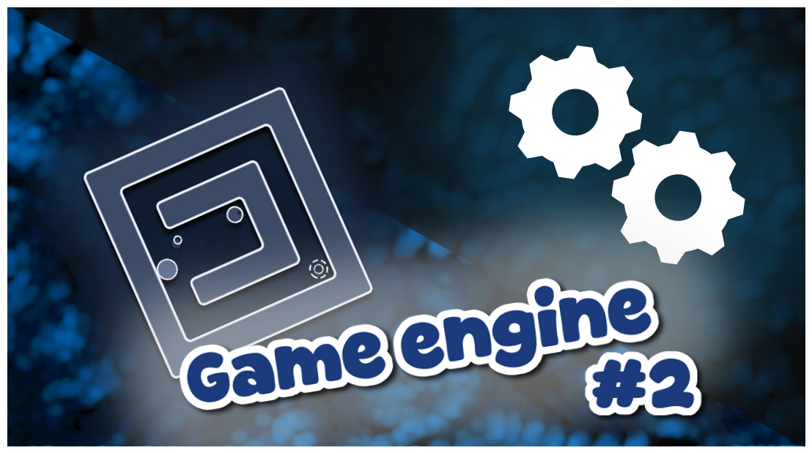
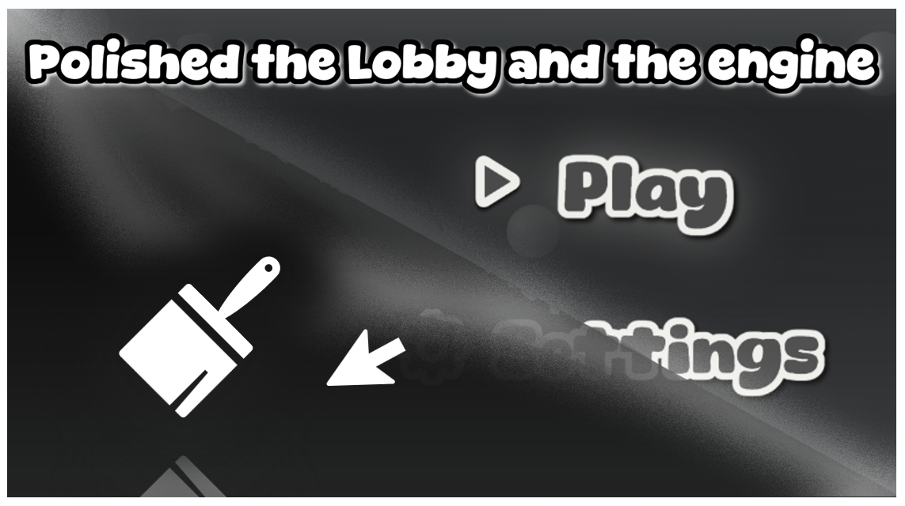
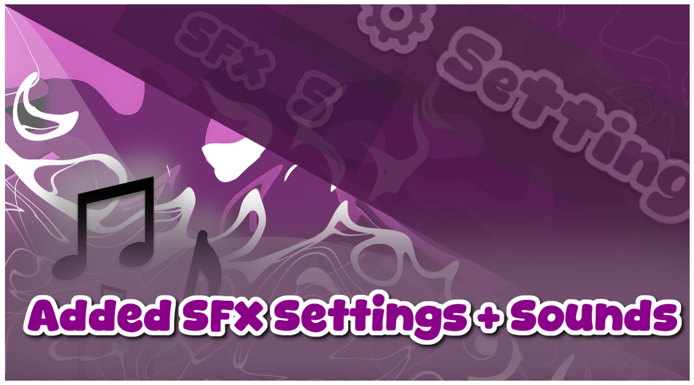
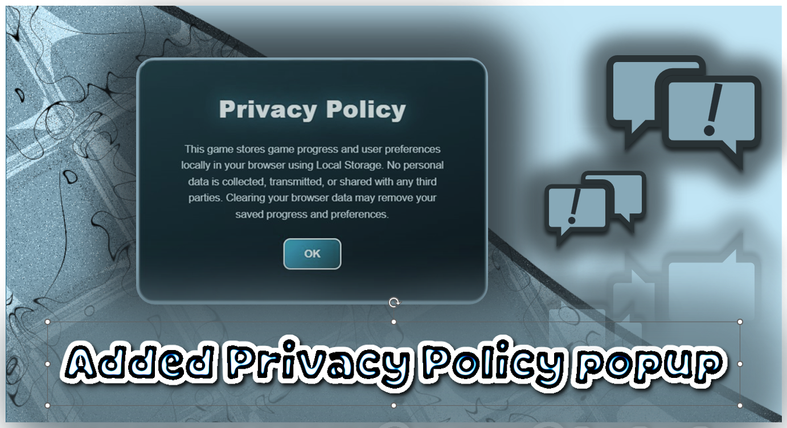
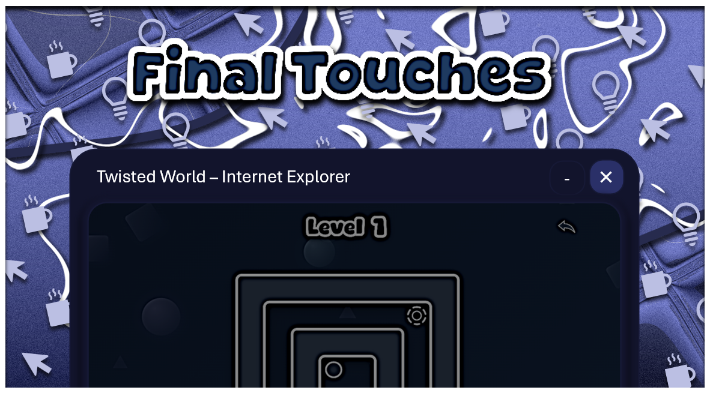

This file also explains where I used AI in this project

(Snipet paste) : Check the `roadmap.md` in the repo's root `/` for AI ussage explained

# Devlog 1 : Building the Game Lobby

## Designing the UI

I started by designing the main lobby buttons: Play and Settings They don't actually do anything yet since I haven't programmed their functionality, but I wanted to establish the overall look of the menu first
I also created the game's logo, keeping it simple and clean. Both the logo and the button text were made using [FlamingTexthttps](//www.flamingtext.com/logo)

## Creating the Lobby

With the UI assets ready, I moved on to designing the lobby itself, my initial idea was based on a color palette suggested by ChatGPT, but after experimenting for a while, I decided to switch to an aqua themed color scheme which fits the atmosphere of the game much better

## Adding Animations

To make the menu feel more alive, I added a few simple animations:

- Button press animations when clicking.
- A gentle up-and-down floating animation for the logo

They're small details, but they make the lobby feel much less static

## Creating the Click Sound

Instead of downloading a button sound from the internet, I decided to make one myself
I literally recorded a sound with my headset microphone by making a clicking noise with my mouth, after recording it, I edited and processed the audio until it sounded like a proper UI button click. Surprisingly, it turned out pretty well!

## Background Parallax

Finally, I added a parallax effect to the background, for this part, I used Claude to help implement the effect
At the moment, the lobby is still fairly simple, but it's now stable enough to serve as a solid foundation for the rest of the game's development
Looking forward to adding actual functionality in the next updates!

# Devlog 2: Level Engine + First Playable Level
The first playable level is now available, along with the core engine that powers the game
Here's a quick overview of what has been added:

## Level Physics Engine
With the help of Claude and a lot of manual work, I built a stable and reusable level engine that behaves consistently and is easy to expandThe ball now lands naturally, rolls correctly across surfaces, and the overall movement feels much smoother than beforeThis engine will serve as the foundation for all future levels

## Level Creation System
All levels are stored inside Levels.js, making it easy to create new content by editing the game's source code

# Level Structure
Each level is defined as a simple grid
Grid symbols

'#' Solid platform or wall
'.' Empty space
'S' Player spawn point
'F' Finish point

Rules
Every row must have the same number of columns
Each level should be square for the best visual results
Every level must contain exactly one S and one F
Creating a New Level

- Creating a new level only requires a few steps

1. Open Levels.js
2. Add a new entry to the LEVELS array
3. Design the level using the grid symbols above
4. Start the level using Game.start(<id>)

- The Play button in the lobby currently launches Level 1

# Entering a Level
At the moment there is only one playable level
Press the Play button in the lobby to start the first test level

# Gameplay
The current build includes a simple test level designed to demonstrate the core mechanics, Just press any key to rotate the world

# Devlog 3: Polish
2
**New Features**

- I added 5 levels to the game. Each level of the game is different from the others in terms of layout and design. The game now saves your progress through the levels to the memory. This means you will not lose your progress when you close the game.

- I changed the way you select levels in the game. When you press the play button it moves to the side. Shows you the available levels. It is not a menu for choosing levels but it looks nice and works well.

- I also added a thing to the game where if you hold down the key button the whole level will flip upside down. This means we can make puzzles that use gravity and rotation.

**Fixes**

- I fixed a problem where the level would stay down after the character died. Now the level will go back, to normal when you restart.

- I fixed another problem where the background would not move with the level when it was flipped. Now the background and the level move together which makes the game look better.

# Devlog 4: ~~Settings~~ Setting

This update introduces the first version of the **Settings** menu. It's pretty minimal for now, but it's the foundation for future options
The first available setting is **SFX Volume**, which can be adjusted from **0 to 5**. Whether you want the full experience or complete silence, you're now in control of the game's sound effects I've also added a new sound effect. From now on, whenever the ball lands on the upper level, it plays a satisfying landing sound, making the gameplay feel more responsive and polished

Here is a more confident and professional version of your devlog:

---

# Devlog 5: Privacy Policy Implementation

I’ve successfully integrated a privacy policy popup that greets first-time users. This ensures transparency regarding how the game utilizes local browser storage to manage and persist player progress.

During development, I encountered a couple of technical hurdles: a UI layering issue where the popup was rendered behind existing buttons, and a deployment conflict on GitHub Pages. I leveraged Codex to help troubleshoot the display logic and resolved the build issues, resulting in a seamless, fully functional experience across all web platforms.

# Devlog 6: Final Polish

I focused on improving the README, expanding it into a detailed and comprehensive guide that clearly explains the project.

For the game, I redesigned the Back button while the player is in a level. Instead of returning immediately, it now displays a confirmation popup, preventing accidental exits and improving the overall user experience.

